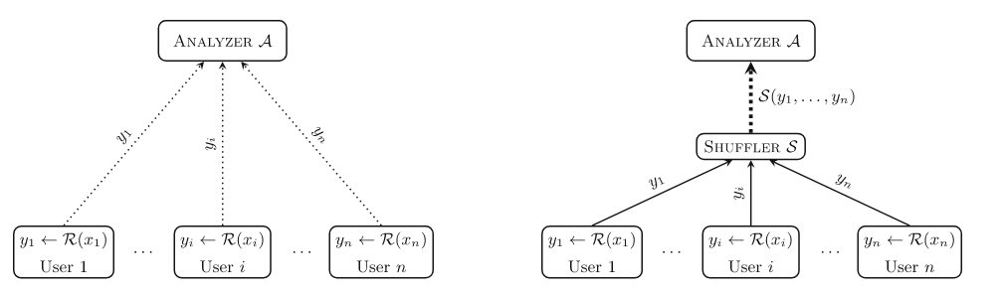

# Frequency Estimation in the Shuffle Model with Almost a Single Message

## Background

1. Central-DP
	- High Accuracy.
	- Calculation in Central Analyzer, a trusted curator.
2. MPC+DP
	- High Accuracy.
	- Massive commutication cost
3. LDP
	- Low Accuracy.
	- Low commutication cost.
4. Shuffle-DP
	- Higher Accuracy.
	- Low commutication cost.

## LDP vs Shuffle-DP

- Shuffler: hardware etc.

## Previous Work

- Borja Balle, James Bell, Adrià Gascón, and Kobbi Nissim. 2019. The Privacy Blanket of the Shuffle Model. In CRYPTO.

- De-bias after aggregation.

### Limitation

- Domain Limitation
	- In their local randomizer, each user sends its input with probability $\rho=\widetilde{O}(B/n)$.
- Low Accuracy on Larger Domain

## This Work

- Improvement of Accuracy.
- Unlock large domain.

### - Small Domain $B<\widetilde{O}(n)$

- $1+\mathcal{O}(\rho)$ messages per user
- with optimal error close to Central-DP

### - Large Domain $B\geq\widetilde{\Omega}(n)$

- $\rho$ messages per user, to ensure DP
- hash to reduce the domain size

### - Balls-into-Bins $\mathcal{M}$

